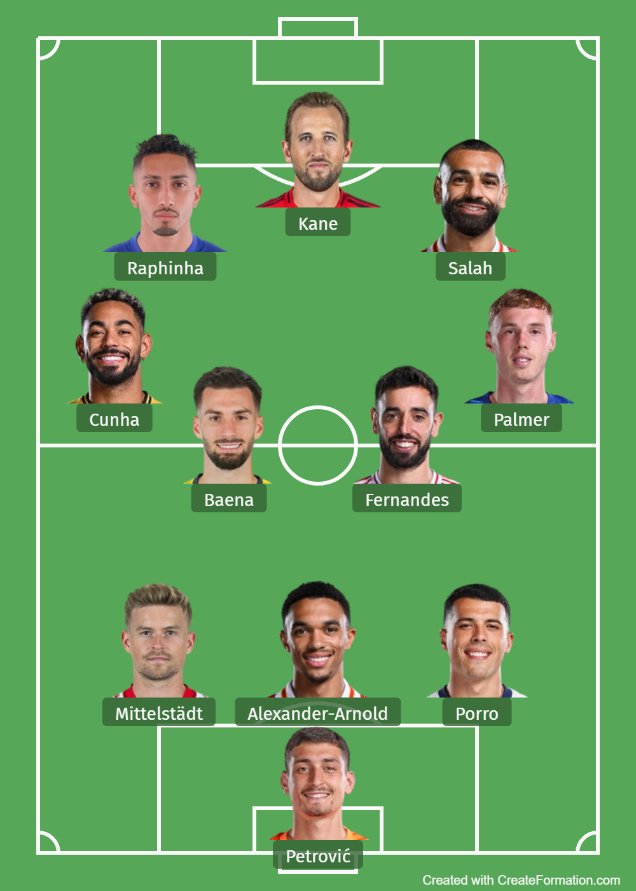

Syed Mohammed Ahmed | syedmohd2002@gmail.com

# Player Performance Evaluation Model in Football

This project identifies the top-performing football players across Europe's top 5 leagues during the 2024/25 season using over 300 per-90-minute performance metrics. The final output is a fully data-driven 3–4–3 formation based on role-specific evaluation and statistical modeling.

## Project Overview

- **Objective:** Rank players by position using statistical performance, not reputation or public voting
- **Dataset:** 2,500+ players, 300+ per-90 statistics from FBref (via StatsBomb)
- **Tools:** Python, pandas, SQLite, SQL, matplotlib, scikit-learn
- **Approach:**
  - Cleaned and filtered player data using pandas
  - Queried structured performance data using SQL (via SQLite)
  - Applied min-max normalization to relevant metrics
  - Designed weighted scoring models tailored to each position
  - Selected the top goalkeeper, defenders, midfielders, and forwards to build a 3–4–3 team

## Position-Specific Evaluation Criteria

**Goalkeepers**  
- Save percentage, goals allowed per 90 (inverted), clean sheets per 90, penalty saves

**Defenders**  
- Tackles + interceptions, blocks, clearances, recoveries, progressive passes/carries, key passes

**Midfielders**  
- Goals, assists, xA, xAG, key passes, progression metrics, recoveries, defensive actions

**Forwards**  
- Split into one striker and two wingers, each with distinct metrics:
  - **Striker:** Goals, xG, goal difference vs xG, non-penalty xG, goal involvement
  - **Wingers:** Assists, xAG, key passes, progressive carries, goals

## Final XI (3–4–3 Formation)

- **Goalkeeper:** Đorđe Petrović  
- **Defenders:** Maximilian Mittelstädt, Trent Alexander-Arnold, Pedro Porro  
- **Midfielders:** Alex Baena, Bruno Fernandes, Matheus Cunha, Cole Palmer  
- **Forwards:** Harry Kane (striker), Raphinha (winger), Mohamed Salah (winger)

## Repository Contents

- `top_xi_player_ranking.ipynb` – Full analysis notebook
- `top_xi_player_ranking.png` – Final XI visual (3–4–3 formation)
